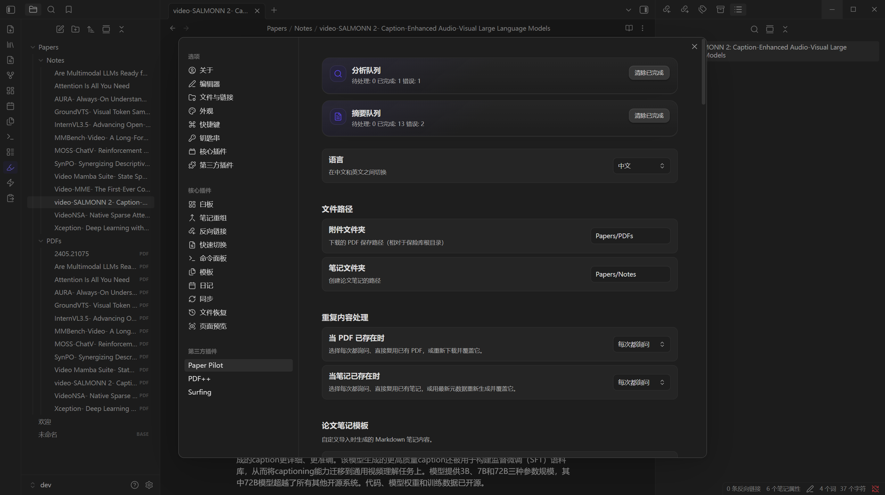
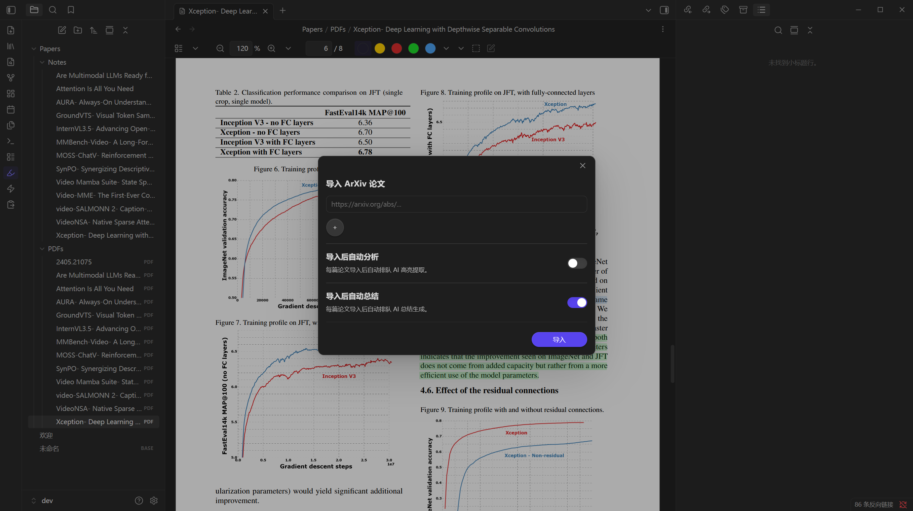
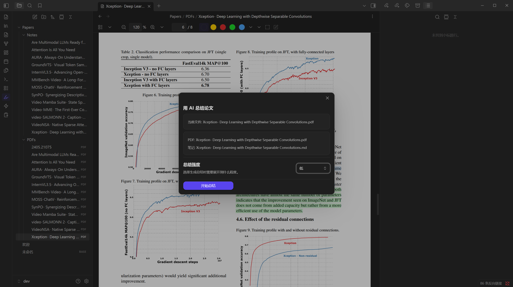
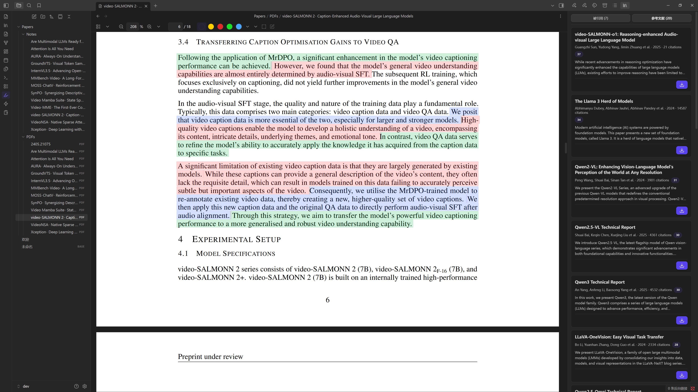
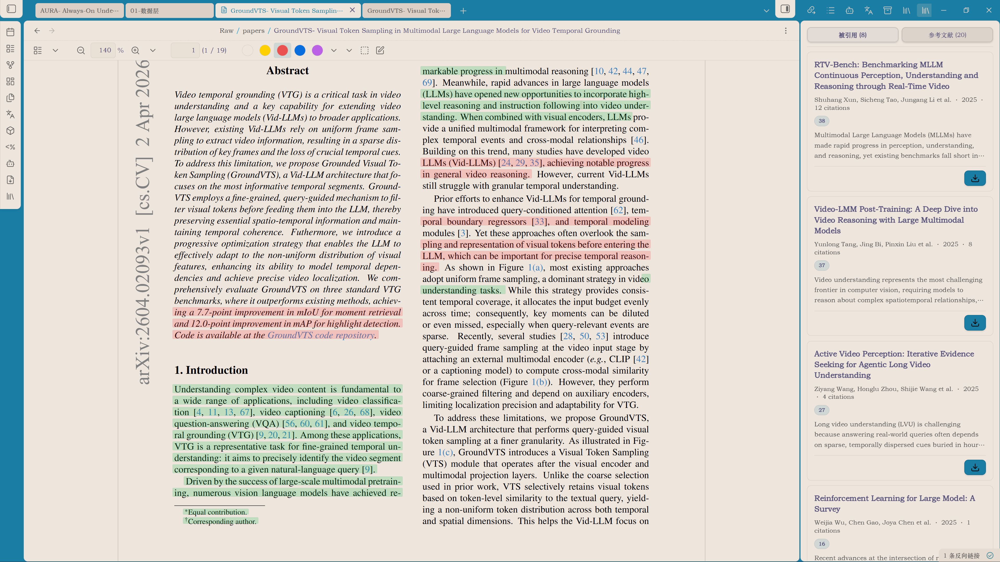

<div align="center">

# Paper Pilot

**Your Obsidian co-pilot for navigating dense academic literature.**

Import arXiv papers, extract AI-powered highlights, and trace every insight back to the source PDF — all without leaving your vault.

[中文说明](README.zh-CN.md)

[](https://obsidian.md)
[](LICENSE)
[](tsconfig.json)
[](manifest.json)

</div>

---

## Installation

Paper Pilot is desktop-only and requires your own LLM API endpoint (OpenAI-compatible). See [Configuration](#configuration) for how to set it up after install.

### Manual install

1. Download `main.js`, `manifest.json`, `styles.css`, and `pdf.worker.min.mjs` from the [latest release](https://github.com/HenryNotTheKing/PaperPilot-Obsidian/releases/latest).
2. Create the folder `.obsidian/plugins/PaperPilot/` inside your vault and place the files there.
3. Open **Settings → Community plugins** in Obsidian and enable **Paper Pilot**.
4. Go to **Settings → Community plugins → Paper Pilot** and fill in your LLM endpoint and model names.

> **Migrating from an older build?**
> If you installed a previous build under `.obsidian/plugins/ai-paper-analyzer/`, move all files to `.obsidian/plugins/PaperPilot/` and reload Obsidian.

### Build from source

```bash
git clone https://github.com/HenryNotTheKing/PaperPilot-Obsidian.git
cd PaperPilot-Obsidian
npm install
npm run build
```

Copy the built `main.js`, `manifest.json`, `styles.css`, and `pdf.worker.min.mjs` into `.obsidian/plugins/PaperPilot/`.

---

## Why "Paper Pilot"?

Academic papers are dense skies — dozens of pages, hundreds of citations, multiple technical threads, all at once.

**Paper Pilot** is your co-pilot: it handles the instrumentation (importing, chunking, extracting, highlighting) so you can focus on the judgment. Like a *pilot study*, it is your first exploratory pass through unfamiliar territory.

---

## Features

| Feature | Detail |
|---|---|
| **arXiv import** | One click to fetch PDF, metadata, and create a linked note |
| **Section-level AI extraction** | Motivation, key steps, and contributions extracted per section |
| **Color-coded PDF highlights** | Highlights painted directly onto the PDF, color-mapped by category |
| **Four summary modes** | Low / Medium / High / Extreme — trade speed for depth |
| **Citation sidebar** | Cited and citing paper retrieval; vault similarity matching |
| **Background queues** | Analysis and summary jobs run without blocking the UI |
| **Bilingual UI** | English and Simplified Chinese |
| **Theme compatible** | Works with any Obsidian theme, light or dark |

---

## Screenshots

### Settings tab



### Import modal



### Summary modal



### PDF highlights + Citation sidebar



### Theme compatibility

Paper Pilot adapts to any Obsidian theme. Highlight colors and sidebar appearance follow your vault's color scheme, and every color is individually configurable in settings.



---

## Configuration

Open **Settings → Community plugins → Paper Pilot**.

### LLM endpoints (required)

| Setting | Description |
|---|---|
| **Extraction model** | OpenAI-compatible API base URL + model name used for section-level highlight extraction |
| **Summary model** | OpenAI-compatible API base URL + model name used for summary generation |
| **API key** | Bearer token for the above endpoints (can be the same key for both) |

Any OpenAI-compatible provider works (OpenAI, DeepSeek, Qwen, local Ollama, etc.).

### Summary effort levels

When generating a summary you choose one of four effort levels. They control the depth, tone, and pipeline used:

| Level | Pipeline | Output style |
|---|---|---|
| **Low** | Single LLM call | A few hundred words: problem, main contributions, brief method outline. For quick triage. |
| **Medium** | Single LLM call | Full-paper summary with per-section bullets. Compact, no jargon expansion — a fast review of a paper you already read. |
| **High** | Multi-stage agent (planner → per-section explainers → formula expansion → merge) | Rigorous academic review: extracted figures and formulas inserted in place, every term defined, plus a **Recommended reading** section with 5 related papers from citations and references. |
| **Extreme** | Multi-stage agent (same structure as High) | Plain-language deep dive in a blog-like voice, written for a first-year graduate student new to the field. Every technical detail, motivation, and design choice is unpacked patiently. |

The output length is governed by soft prompt-level guidance, not by hard token caps, so the model can adapt its length to the paper's complexity. Concurrency for all multi-stage fan-outs is controlled by the single **LLM concurrency** setting.

**Recommendation:** Start with **Medium** for a first read. Use **High** when you need methodology rigor; use **Extreme** when you want intuition and beginner-friendly explanations. Use **Low** for a quick abstract-level triage.

### Other settings

| Setting | Description |
|---|---|
| Language | UI language — English or Simplified Chinese |
| File paths | Where PDFs and notes are saved inside your vault |
| Duplicate handling | What to do when a paper is already in your vault |
| Paper note template | Custom frontmatter and body template for new notes |
| Hugging Face paper markdown | Additional metadata fields from Hugging Face Papers |
| Highlight colors | Per-category colors: motivation, method, result, background, other |
| Highlight opacity | Overlay transparency (0.15 – 1.0) |
| LLM concurrency | How many parallel LLM requests are allowed |
| Citation sidebar | Depth, source, and display options for the citation panel |

---

## Privacy

Paper Pilot does not include telemetry. PDFs are parsed locally with `pdfjs-dist`, and only the extracted text chunks you choose to process are sent to your configured LLM endpoint. No data is sent anywhere else.

---

## Development

```bash
npm install       # install dependencies
npm run dev       # watch mode (fast rebuild)
npm run build     # production build (type-check + minify)
npm run lint      # ESLint with typescript-eslint
npm run test      # Vitest unit tests
```

---

## License

[MIT](LICENSE) © HenryNotTheKing