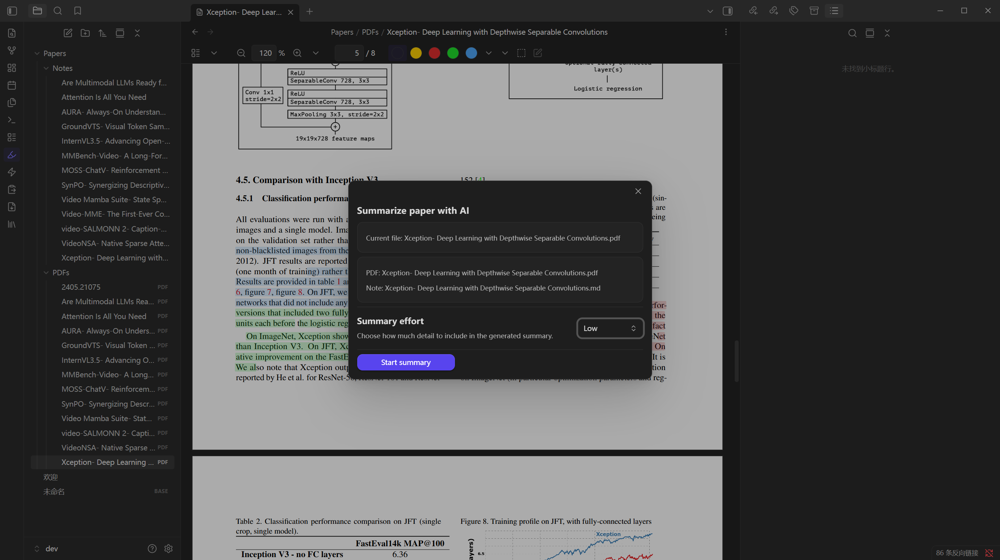
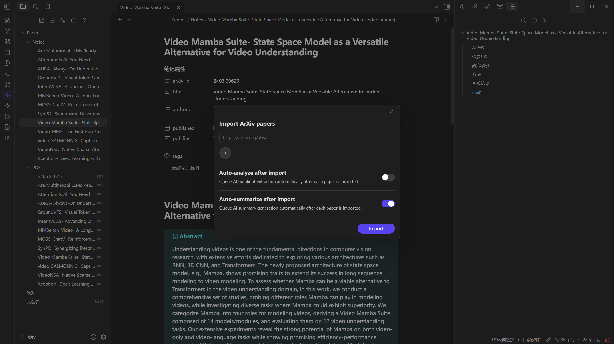
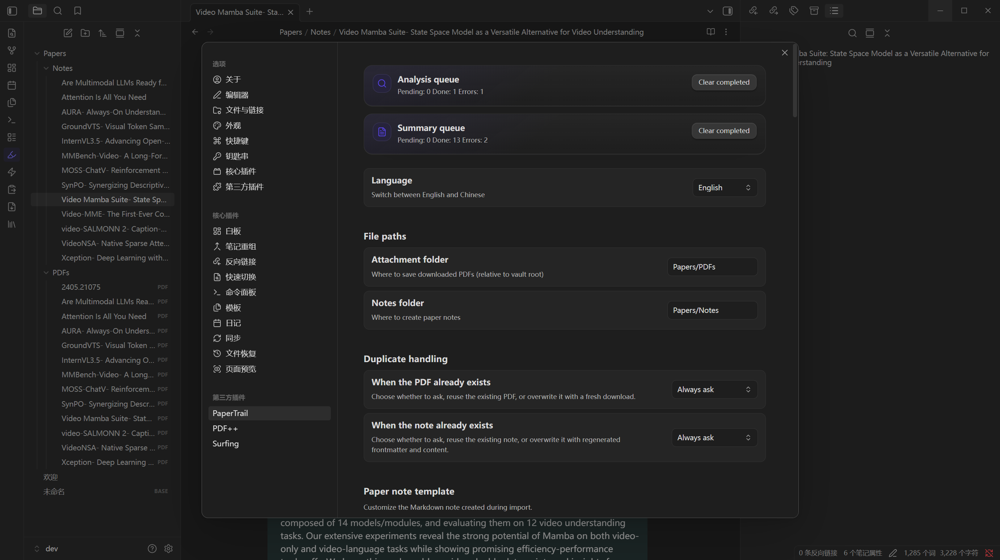

<div align="center">

# 🛩️ PaperPilot

**Your co-pilot for navigating dense academic PDFs.**

An Obsidian plugin that imports arXiv papers, asks an LLM to surface the sentences that matter, and lays a color-coded flight path of highlights from your notes back to the original PDF.

[](https://obsidian.md)
[](LICENSE)
[](tsconfig.json)
[](manifest.json)

</div>

---

> **Why "PaperPilot"?**
> Reading research is a long-haul flight: a thick fog of formulas, dense terminology, and dozens of branching citations. *PaperPilot* is the co-pilot at your side — it imports the paper for you, picks out the sentences that actually drive the argument, and keeps a clear flight path from every note back to the page that proved it.

## ✨ Features

- 🔗 **One-click arXiv import** — paste any arXiv URL or ID; the plugin downloads the PDF, fetches metadata, and creates a Markdown note with frontmatter (`arxiv_id`, `title`, `authors`, `published`, `pdf_file`).
- 🎨 **AI highlight extraction** — sends the paper section-by-section to your LLM and color-codes the returned sentences directly on the PDF (motivation · key step · contribution).
- 🧠 **Tiered AI summaries** — choose Low / Medium / High / Extreme effort to generate everything from a one-paragraph TL;DR to a full tutorial-style walkthrough with reviewer pass.
- 🔍 **Citation sidebar** — pulls forward & backward citations from Semantic Scholar / OpenAlex / arXiv with TF‑IDF + fuzzy matching against your vault so you can spot which references you've already imported.
- 🌐 **Bring-your-own LLM** — works with any OpenAI-compatible endpoint (OpenAI, Anthropic, SiliconFlow, DeepSeek, local Ollama, …) plus optional Hugging Face paper-markdown source.
- 🗂️ **Background queues** — analysis and summary requests run on independent worker pools; close the modal and keep working while the route is plotted.
- 🌍 **Bilingual UI** — full English and 简体中文 translations, including default summary prompts in both languages.

## 📸 Gallery

### Color-coded highlights, anchored to the original PDF
Every AI-extracted sentence is rendered as an Obsidian PDF annotation that links back to its exact page and position. Click a highlight in the note → jump to the page. Click a sentence in the PDF → see the surrounding context.


### Summarize a paper from the active PDF or note
Pick the effort level and let the queue do the rest. The dialog appears over the document so you can keep reading while the request is dispatched.



### Import any arXiv paper without leaving Obsidian
Paste a URL, choose how to handle duplicates, and optionally auto-analyze on import.



### Configure once, forget about it
Paths, models, providers, prompts, highlight colors, queue concurrency — all in one settings tab.



## 🚀 Installation

PaperPilot is **desktop-only** (it depends on `pdfjs-dist` and Node-flavored APIs).

### Option A — Manual install (recommended while pre-release)

1. Download the latest `main.js`, `manifest.json`, `styles.css`, and `pdf.worker.min.mjs` from the [Releases page](https://github.com/HenryNotTheKing/PaperPilot-Obsidian/releases).
2. Create the folder `<your-vault>/.obsidian/plugins/paper-pilot/` and drop the four files inside.
3. In Obsidian, open **Settings → Community plugins**, disable Restricted Mode if needed, then refresh the installed-plugins list and toggle **PaperPilot** on.

### Option B — Build from source

```bash
git clone https://github.com/HenryNotTheKing/PaperPilot-Obsidian.git
cd PaperPilot-Obsidian
npm install
npm run build
```

Copy `main.js`, `manifest.json`, `styles.css`, and `pdf.worker.min.mjs` into `<your-vault>/.obsidian/plugins/paper-pilot/` and enable the plugin.

For active development, run `npm run dev` from inside `<your-vault>/.obsidian/plugins/paper-pilot/` itself — esbuild watches and rebuilds in place.

## ⚙️ Configuration

Open **Settings → Community plugins → PaperPilot**. The minimum to get started is **Extraction model** + **Summary model**; everything else has sensible defaults.

| Section | What you set | Notes |
|---|---|---|
| **Language** | UI language (English / 中文) | Switches every label, default prompts, and ribbon tooltips. |
| **File paths** | Attachment folder, notes folder | Defaults to `Papers/PDFs` and `Papers/Notes` (created automatically). |
| **Duplicate handling** | What to do when a PDF or note already exists | `Always ask` / `Reuse existing` / `Overwrite`. |
| **Paper note template** | Markdown skeleton used at import time | Supports `{{arxiv_id}}`, `{{title}}`, `{{authors_yaml}}`, `{{published}}`, `{{abstract}}`, `{{pdf_file}}`. |
| **Extraction model** | LLM that returns highlight sentences | Any OpenAI-compatible `chat/completions` endpoint, or Anthropic Messages. |
| **Summary model** | LLM that writes tiered summaries | Can differ from the extraction model — use a cheaper one for highlights, a stronger one for high-effort summaries. |
| **Hugging Face paper markdown** | Optional bearer token + "prefer HF" toggle | When enabled, summaries source `https://huggingface.co/papers/{id}.md` first and fall back to PDF parsing. |
| **Summary generation** | Default effort, auto-summarize on import, Extreme review pass | Effort levels: **Low** (one paragraph) → **Medium** (sectioned) → **High** (tutorial depth) → **Extreme** (full walkthrough + reviewer pass). |
| **Summary prompts** | The four prompts per language | Click *Restore default* to reset. |
| **Extraction prompt** | System prompt sent with every chunk | Constrain types to `motivation`, `key_step`, `contribution`. |
| **Highlight colors / opacity** | Per-type color and overall opacity | Renders both via Obsidian's native PDF highlights and (when present) the [PDF++](https://github.com/RyotaUshio/obsidian-pdf-plus) `&color=` parameter. |
| **LLM concurrency** | Max simultaneous requests (1–10) | The plugin also auto-throttles based on observed rate limits. |
| **Citation sidebar** | Enable, max results, Semantic Scholar key, frontmatter aliases | An API key is optional — without one, requests are throttled to 1 req/s. |

> 🔐 **Privacy.** PaperPilot only talks to the endpoints you configure. PDFs are parsed locally; only the extracted text chunks are sent to the LLM. No telemetry, no auto-update of plugin code outside normal releases.

## 🧭 How to use

1. **Import** — click the *Import arXiv paper* ribbon icon (or run the command of the same name) and paste one or more arXiv URLs / IDs.
2. **Analyze** — open any imported PDF and run **Analyze current paper**. A queue worker chunks the PDF, asks the LLM for highlights per section, and paints them on the page.
3. **Summarize** — with the PDF or note active, run **Summarize current paper**, pick an effort level, and the result is appended to the note as a collapsible `> [!summary]` callout.
4. **Explore citations** — open a paper note and click the *Citation graph* ribbon icon. Cited / citing papers appear in the right sidebar with a similarity score against your active note; clicking a known reference jumps to that note.

### Commands

| Command ID | Default name | Context |
|---|---|---|
| `ai-paper-analyzer:import-arxiv-paper` | Import arXiv paper | Always available |
| `ai-paper-analyzer:analyze-arxiv-paper` | Analyze current paper | Active file is a PDF |
| `ai-paper-analyzer:summarize-current-paper` | Summarize current paper | Active file is a PDF or paper note |
| `ai-paper-analyzer:open-citation-sidebar` | Open citation sidebar | Active file is a recognized paper note |

## 🛠️ Development

```bash
npm install
npm run dev      # esbuild in watch mode
npm run build    # type-check + production bundle
npm run lint     # eslint + obsidianmd plugin rules
npm run test     # vitest
```

The codebase is intentionally split into many small modules — see `src/services/` for everything pipeline-related and `src/ui/` for modals, sidebar, and the highlight overlay. The full architectural spec lives at `docs/superpowers/specs/2026-04-19-ai-paper-analyzer-design.md`.

## 🤝 Contributing

Issues and PRs are welcome. Please run `npm run lint && npm run test` before opening a PR. For larger features, open an issue first so we can sketch it out together.

## 📄 License

[MIT](LICENSE) © HenryNotTheKing. PaperPilot is not affiliated with arXiv, Hugging Face, Semantic Scholar, or OpenAlex; it merely talks to their public APIs.
