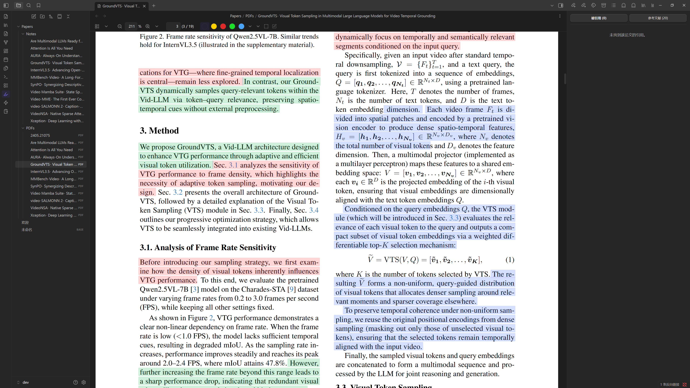

<div align="center">

# Paper Pilot

你的 Obsidian 论文副驾。

[English](README.md)

[](https://obsidian.md)
[](LICENSE)
[](tsconfig.json)
[](manifest.json)

</div>

## 简介

Paper Pilot 是一个面向 Obsidian 的桌面插件，帮助你把 arXiv 论文导入、精读、总结、回溯整合到同一个工作流里。

它不只是给你一段 AI 总结，而是把证据链真正保留下来：先导入 PDF 与元数据，再按章节调用 LLM 提取关键句，然后把这些句子按类型高亮回写到 PDF，让你的笔记能够直接追溯到支撑结论的原始页面。

## 功能

- 一键导入 arXiv 论文，自动创建 PDF、元数据和笔记。
- 按章节提取动机、关键步骤、贡献，并写回 PDF 高亮。
- 提供 Low / Medium / High / Extreme 四档摘要。
- 提供引用侧栏，抓取 cited / citing 论文并与库内笔记做相似度匹配。
- 分析和摘要支持后台队列执行。
- 支持英文和简体中文界面。

## 截图

### 设置页


### 导入弹窗


### 摘要弹窗


### PDF 高亮效果



## 安装

Paper Pilot 目前仅支持桌面端。

### 手动安装

1. 从 release 页面下载 `main.js`、`manifest.json`、`styles.css`、`pdf.worker.min.mjs`。
2. 将它们放进你的库目录 `.obsidian/plugins/ai-paper-analyzer/`。
3. 在 Obsidian 中打开 `设置 -> 第三方插件`，启用 Paper Pilot。

说明：当前插件展示名是 `Paper Pilot`，但插件 ID 仍然保留为 `ai-paper-analyzer`，这样可以兼容已有安装和历史数据。

### 从源码构建

```bash
git clone https://github.com/HenryNotTheKing/PaperPilot-Obsidian.git
cd PaperPilot-Obsidian
npm install
npm run build
```

## 配置

打开 `设置 -> 第三方插件 -> Paper Pilot`。

最少需要配置：

- Extraction model
- Summary model

常用配置项包括：

- Language
- File paths
- Duplicate handling
- Paper note template
- Hugging Face paper markdown
- Highlight colors and opacity
- LLM concurrency
- Citation sidebar

## 隐私

Paper Pilot 不包含遥测。PDF 在本地解析，只有你选择交给模型处理的文本片段会发送到你配置的 LLM 接口。

## 开发

```bash
npm install
npm run dev
npm run build
npm run lint
npm run test
```

## 许可证

[MIT](LICENSE) © HenryNotTheKing